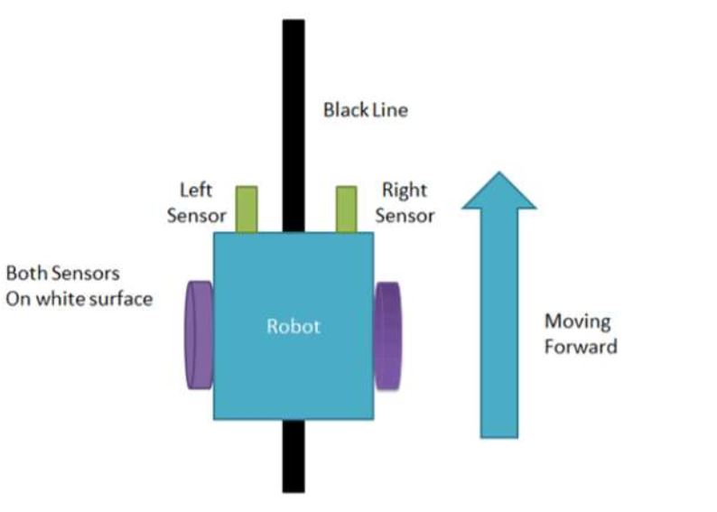
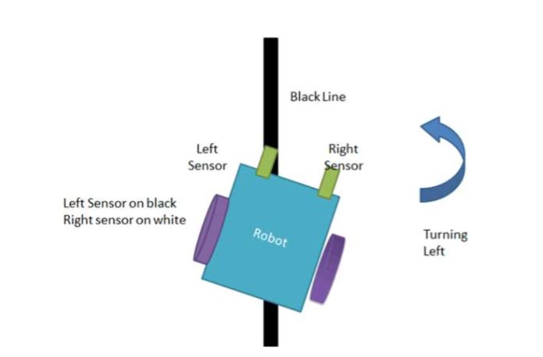
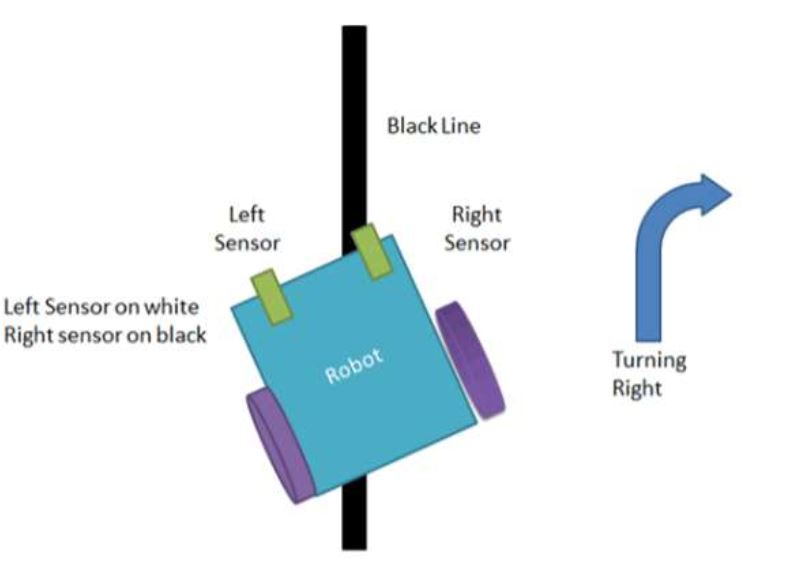
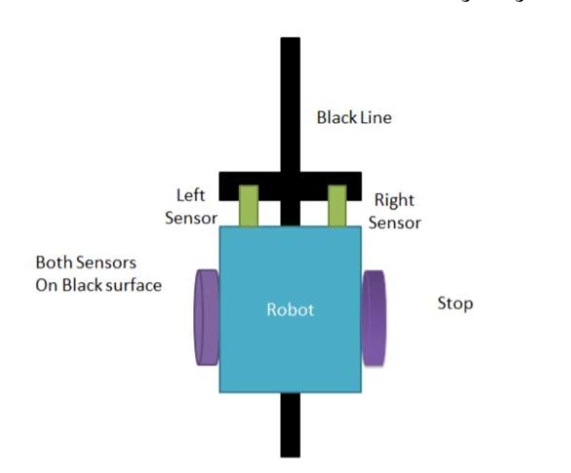

# Micro-Course-IUT
In this course we were a team of two.  
Collaborator: Ali Ghadiri

* *Our Final Project:*  
We implemented a line follower robot which it's Proteus in shown below: 

In this project we used IR sensors to detect surface color.(white or black)  
So we will have 4 different states:
1. 
2. 
3. 
4. 
