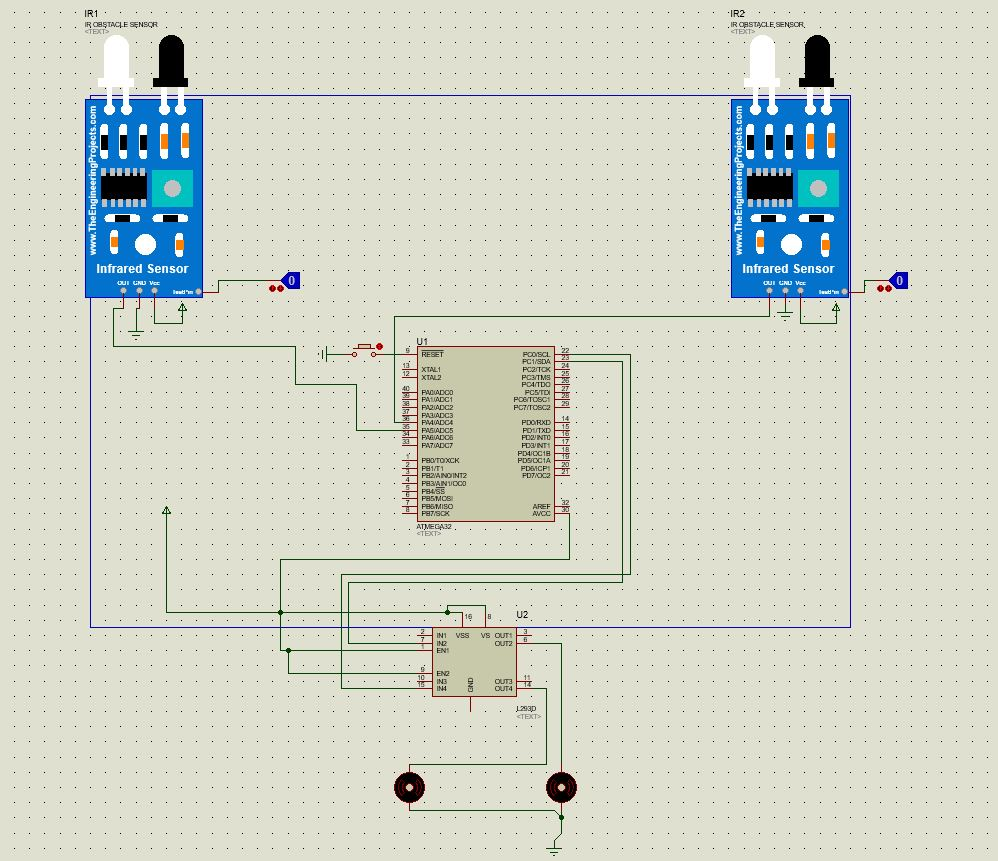

# Micro-Course-IUT
Collaborator: Ali Ghadiri

* *Our Final Project:*  
We implemented a line follower robot using atmega32 which it's Proteus in shown below: 

In this project we used IR sensors to detect surface color.(white or black)  
So we will have 4 different states:
1. 
3. 
4. 
5. 

